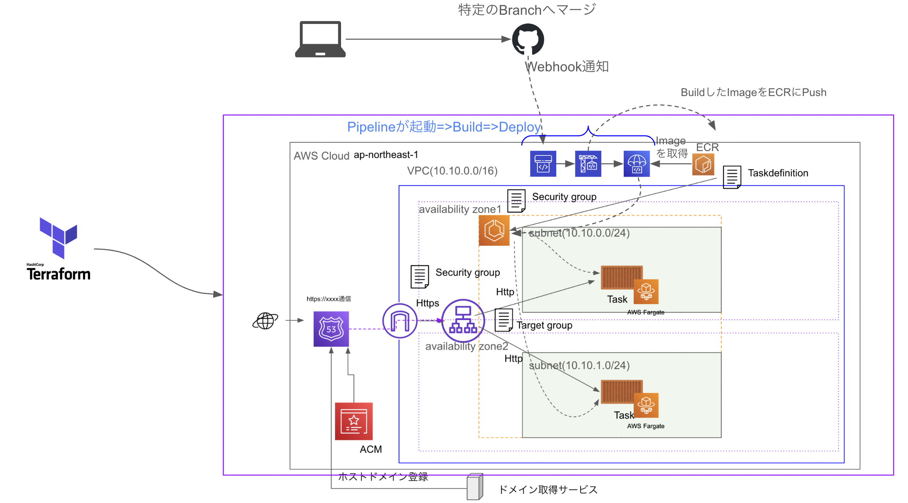

# code-pipeline-template

## Overview

AWS CodePipeline を用いた CI/CD 構成

## Architecture



## How to Development

- Clone Repository
- change directory to `terraform`

```sh
# make envs directory
mkdir -p envs/dev

# create tfvars files
touch envs/dev/backend.tfvars
touch envs/dev/variable.tfvars
```

- Create S3 bucket for registory tfstate

## terraform command

- use `Makefile`

## Build Image

- if deploy ecs task , GET request custom domain in your browser , open this page
  
